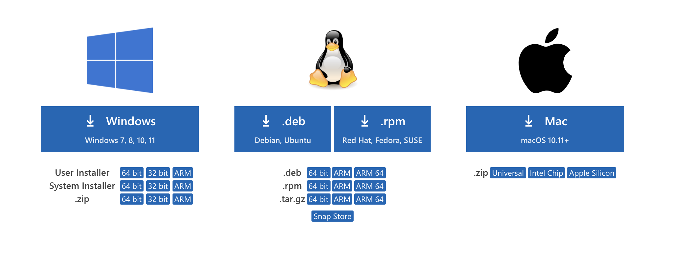
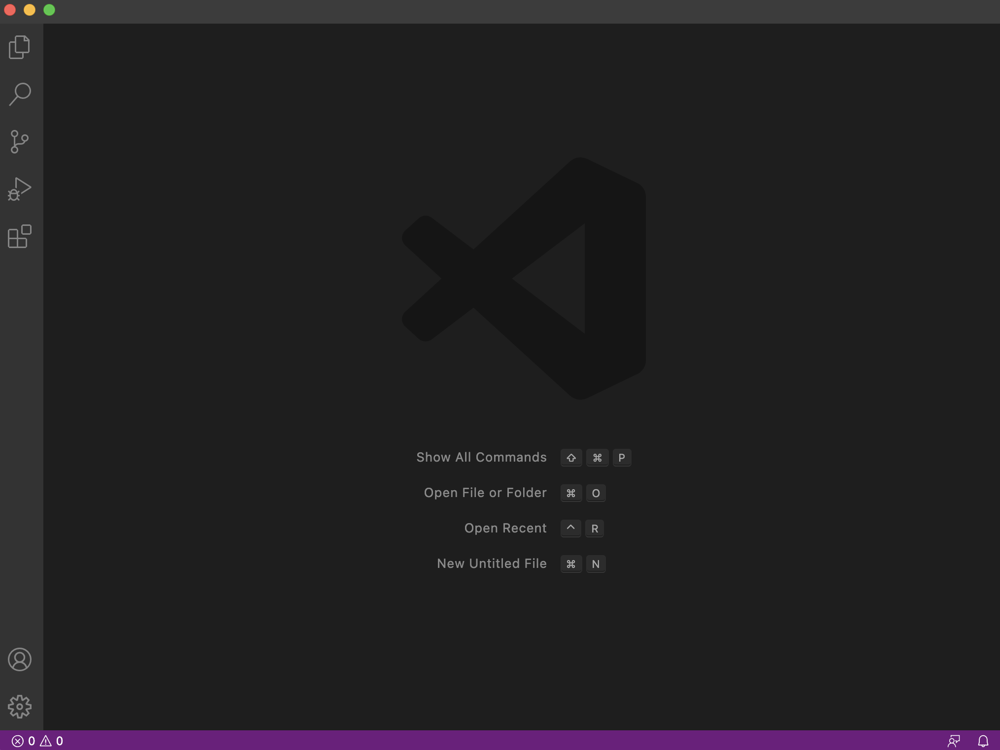
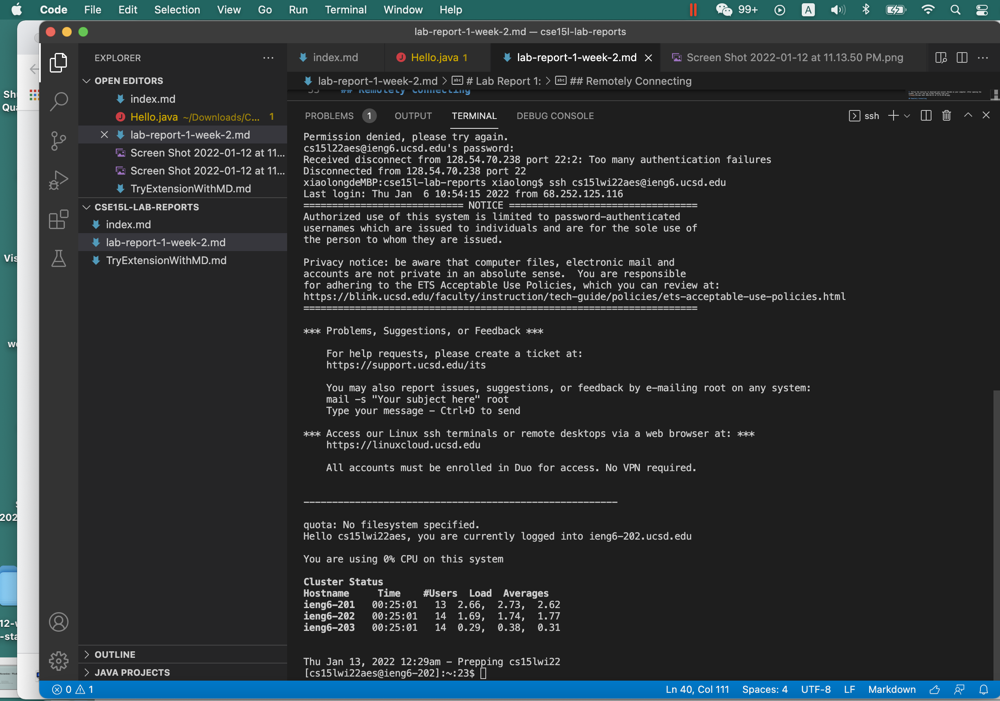
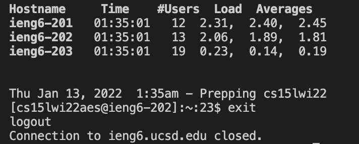
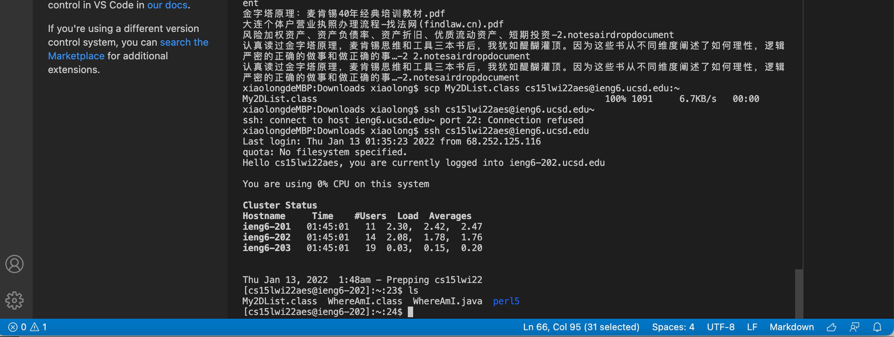

# Lab Report 1:  
## The Best Tutorial about Loging Into a Course-specific Account on ieng6
written by Shuyi Han(PID: A16470709) on Jan 12th 2022

## Overview 
The tutorial is going to walk you through every single step needed to log into a course-specific account on ieng6 and teach you some basic commands and concepts. No prior knowledge required, after reading this, you are going to be more comfortable by the next time you have to deal with operations relating account on ieng6. 

**What you will learn**
* Installing VScode
* Remotely Connecting
* Trying Some Commands
* Moving Files with scp
* Setting an SSH Key
* Optimizing Remote Running

**What you will learn**
A laptop with one of the major operating systems 

*Let's get started*

## Installing VScode
1. Click on [this link](https://code.visualstudio.com/)

2. This IDE has different versions built for all the major operating system.Select the one that fits you computer.

3. Follow the tutorial to download and install VScode on your computer. After opening the window, you will see the screen looking like this.  

## Remotely Connecting

Since there are always circumstances when you have to use or control remote servers intead of your own, some instutions give users specific account to get on certain systems. We will try to our own computer to a remote server in this step.

1. If you have a windows system, click on [this link](https://sdacs.ucsd.edu/~icc/index.php) and download. Since I have a Mac System, I did not do this step.
2. Then, find your own 15L's course-specific account using [this link](https://sdacs.ucsd.edu/~icc/index.php). You should change the password in order to log into the account.
3. Open a terminal in VScode by clicking on **Terminal** on the top left of the screen, and select **New Terminal** Type in `ssh cs15lwi22aes@ieng6.ucsd.edu ` with the aes be changed with some characters in your course account. Then, type in your password after the terminal is showing `Password: `. Then, the temrinal should be looking like mine.

4. In here, I typed `ssh cs15lwi22aes@ieng6.ucsd.edu ` and given my password. Now, my own computer, the client's terminal  gets connected with a computer, or the server, in CSE basedment.

## Type some commands 
1. Every line starting with `[cs15lwi22aes@ieng6-202]:~:` indicates I have logged in the ieng6 account, and that means any command I run on the computer will also run on the server.
2. To try some commands, I type the following commands. You are also encouraged to do so.
* cd ~
change directory to defualt or home directory
* cd
change directory
* ls -lat
* ls -a
listing all the files in the current folder and showing content of the current directory
* cp /home/linux/ieng6/cs15lwi22/public/hello.txt ~/
copy a file or a folder
* cat /home/linux/ieng6/cs15lwi22/public/hello.txt
create, view, concatenate file
3. After running all the commands, the screen should look like this

4. If you want to run the command on your own computer instead of the remote sever. You should type in `exit`

## Moving Files with scp

One way to move files back and forth between server and client, in other words, copy a file from my computer to the remote one is the command `scp`
1. To copy a file called `My2DList.class` to the remote computer, I typed `scp My2DList.class cs15lwi22aes@ieng6.ucsd.edu:~/` . scp stands for secure copy, followed by the file name, which followed by the course account name
2. To check if the command works, I log into ineg6 by command `ssh cs15lwi22aes@ieng6.ucsd.edu` and run `ls` to list all the file in the defualt direcotry. You can see that `My2DList.class` is there now. 

## Setting An SSH Key

## Optimizing Remote Running
